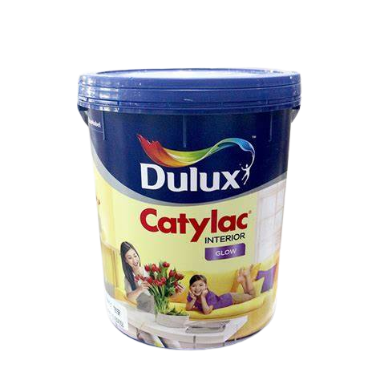
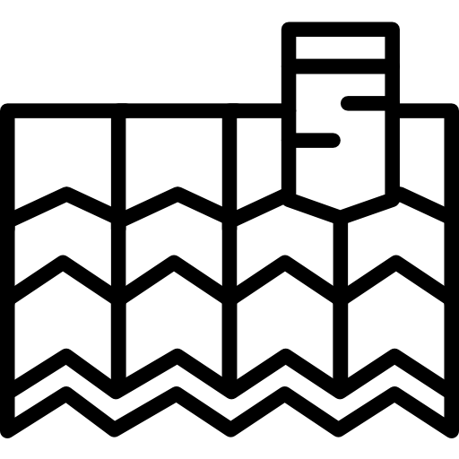

# Nama Lengkap Mahasiswa
Nama : Muhammad Hanif Sauqi

NIM : 22/495097/SV/20949

# Penjelasan Website Secara Umum
CatMart adalah sebuah website e-commerce yang menyediakan berbagai macam cat. Dengan berbagai pilihan cat yang lengkap dan berkualitas, CatMart merupakan tempat yang tepat untuk Anda yang mencari produk cat terbaik. Website ini menawarkan berbagai merek cat terkenal dan terpercaya, mulai dari cat interior, cat eksterior, hingga cat khusus untuk berbagai permukaan.

Melalui platform CatMart, Anda dapat dengan mudah menjelajahi katalog lengkap produk cat yang ditawarkan. website ini menyediakan deskripsi detail untuk setiap produk

Selain kemudahan dalam memilih produk, CatMart juga menawarkan berbagai fasilitas yang memudahkan proses pembelian. Anda dapat dengan cepat menambahkan produk ke keranjang belanja, melakukan pembayaran dengan berbagai metode yang aman dan terpercaya, serta memantau status pengiriman barang dengan mudah. Website ini juga memiliki tim layanan pelanggan yang siap membantu Anda dalam menangani pertanyaan atau masalah yang mungkin timbul.

Dengan keunggulan dalam kualitas produk, katalog yang lengkap, serta layanan yang responsif, CatMart menjadi solusi terbaik untuk memenuhi kebutuhan cat Anda secara online. Tidak perlu repot lagi pergi ke toko fisik, CatMart hadir sebagai platform yang nyaman dan terpercaya untuk membeli berbagai jenis cat yang Anda butuhkan.
### Tujuan
Tujuan dari website CatMart adalah memberikan pengalaman belanja yang mudah, nyaman, dan terpercaya bagi para konsumen yang membutuhkan cat.dan juga agar bisa  menjadi platform terpercaya dan nyaman bagi para konsumen yang membutuhkan cat. Dengan menyediakan pengalaman belanja yang mudah, katalog lengkap, informasi produk yang detail, dan layanan pelanggan yang responsif, website ini berusaha memenuhi kebutuhan dan harapan konsumen yang ingin membeli cat secara online.
### Permasalahan yang Dicover
Website KangSembakOnline hadir untuk menyelesaikan beberapa permasalahan yang sering dihadapi dalam pembelian sembako secara tradisional. Beberapa masalah yang kami coba atasi meliputi :
1. Keterbatasan Akses: CatMart memberikan solusi bagi konsumen yang menghadapi keterbatasan aksesibilitas ke toko fisik yang menjual cat. Dengan adanya platform online, konsumen dapat dengan mudah mengakses berbagai produk cat yang dibutuhkan tanpa harus meninggalkan rumah. Ini sangat membantu bagi mereka yang tinggal di daerah yang jauh dari toko cat atau memiliki mobilitas terbatas.
2. Ketersediaan dan Pilihan Produk: CatMart menyediakan katalog yang lengkap dan beragam produk cat. Hal ini membantu konsumen untuk menemukan produk yang tepat sesuai dengan kebutuhan mereka. Dalam toko fisik, ketersediaan stok barang mungkin terbatas, tetapi CatMart memastikan bahwa konsumen memiliki akses ke berbagai merek, jenis, warna, dan ukuran cat yang mereka cari.
3. Informasi Produk yang Lengkap: Website ini juga mengatasi permasalahan kurangnya informasi yang tersedia di toko fisik. Setiap produk cat di CatMart dilengkapi dengan deskripsi yang detail, termasuk spesifikasi teknis, cara penggunaan, dan ulasan dari pelanggan sebelumnya. Informasi ini membantu konsumen membuat keputusan pembelian yang lebih baik dan memastikan bahwa produk yang mereka pilih sesuai dengan kebutuhan mereka.
4. Kemudahan dalam Proses Pembelian: CatMart menyederhanakan proses pembelian cat. Konsumen dapat dengan mudah menambahkan produk ke keranjang belanja, memilih metode pembayaran yang aman dan terpercaya, serta memantau status pengiriman barang secara real-time. Hal ini mengurangi kerumitan dan meningkatkan kenyamanan bagi konsumen saat berbelanja produk cat.
### Kontribusi
Kami berkomitmen untuk memberikan layanan terbaik kepada klien kami maupun brand yang bekerjasama dan terus meningkatkan pengalaman belanja online mereka. CatMart hadir untuk memudahkan akses dan memenuhi kebutuhan Cat Anda dengan cepat, mudah, dan terpercaya.

# Kriteria Penilaian (4 Requirement Dasar)
### 1. Desain rapi mengikuti kaidah atau prinsip desain

berikut salah satu potongan kode untuk kriteria pertama :

```html
<!DOCTYPE html>
<html lang="en">
<head>
   <meta charset="UTF-8">
   <meta http-equiv="X-UA-Compatible" content="IE=edge">
   <meta name="viewport" content="width=device-width, initial-scale=1.0">
   <title>home</title>

   <link rel="stylesheet" href="https://unpkg.com/swiper@8/swiper-bundle.min.css" />
   
   <!-- font awesome cdn link  -->
   <link rel="stylesheet" href="https://cdnjs.cloudflare.com/ajax/libs/font-awesome/6.1.1/css/all.min.css">

   <!-- custom css file link  -->
   <link rel="stylesheet" href="css/style.css">

   <link rel='stylesheet' href='https://cdn-uicons.flaticon.com/uicons-regular-straight/css/uicons-regular-straight.css'>

</head>
<body>
   
<?php include 'components/user_header.php'; ?>

<div class="home-bg">

<section class="home">

   <div class="swiper home-slider">
   
   <div class="swiper-wrapper">

      <div class="swiper-slide slide">
         <div class="image">
            
         </div>
         <div class="content">
            <span>Best Seller </span>
            <h3>Cat Tembok</h3>
            <a href="shop.php" class="btn">shop now</a>
         </div>
      </div>

      <div class="swiper-slide slide">
         <div class="image" style="">
            
         </div>
         <div class="content">
            <span>Best Price</span>
            <h3>Perlengkapan Cat</h3>
            <a href="shop.php" class="btn">shop now</a>
         </div>
      </div>

   </div>

      <div class="swiper-pagination"></div>

   </div>

</section>

</div>

<section class="category">

   <h1 class="heading">Category</h1>

   <div class="swiper category-slider">

   <div class="swiper-wrapper">

   <a href="category.php?category=cat tembok" class="swiper-slide slide">
      
      <h3>Cat tembok</h3>
   </a>

   <a href="category.php?category=cat duco" class="swiper-slide slide">
      
      <h3>Cat duco</h3>
   </a>

   <a href="category.php?category=cat gypsum" class="swiper-slide slide">
      
      <h3>Cat gypsum</h3>
   </a>

   <a href="category.php?category=cat kayu&besi" class="swiper-slide slide">
      
      <h3>Cat kayu&besi</h3>
   </a>

   <a href="category.php?category=cat genteng" class="swiper-slide slide">
      
      <h3>Cat genteng</h3>
   </a>

   <a href="category.php?category=perlengkapan" class="swiper-slide slide">
      
      <h3>Perlengkapan</h3>
   </a>

   </div>

   <div class="swiper-pagination"></div>

   </div>

</section>
```

Penjelasan :

Potongan kode tersebut menggambarkan struktur dasar HTML untuk membangun halaman website CatMart. Desain rapi dapat dicapai dengan menggunakan prinsip desain yang konsisten, seperti menggunakan header, nav, main, dan footer untuk membagi tampilan menjadi bagian-bagian yang terorganisir. Selain itu, referensi ke file style.css menunjukkan penggunaan stylesheet untuk mengatur tampilan secara terpusat, memastikan keseragaman desain di seluruh halaman.


### 2. Website responsive, dapat diakses melalui device

berikut salah satu potongan kode untuk kriteria kedua :

```css
@media (max-width:991px){

   html{
      font-size: 55%;
   }

}

@media (max-width:768px){

   #menu-btn{
      display: inline-block;
   }

   .header .flex .navbar{
      position: absolute;
      top:99%; left:0; right:0;
      border-top: var(--border);
      border-bottom: var(--border);
      background-color: var(--white);
      transition: .2s linear;
      clip-path: polygon(0 0, 100% 0, 100% 0, 0 0);
   }

   .header .flex .navbar.active{
      clip-path: polygon(0 0, 100% 0, 100% 100%, 0% 100%);
   }

   .header .flex .navbar a{
      display: block;
      margin:2rem;
   }

   .home-bg .home .slide .content{
      text-align: center;
   }

   .home-bg .home .slide .content h3{
      font-size: 3rem;
   }

}

@media (max-width:450px){

   html{
      font-size: 50%;
   }

   .heading{
      font-size: 3rem;
   }

   .flex-btn{
      flex-flow: column;
      gap:0;
   }

   .quick-view form .row .image-container .sub-image img{
      width: 8rem;
   }

   .checkout-orders form .flex .inputBox{
      width: 100%;
   }

}
```

penjelasan :

CSS di atas mencakup beberapa media query yang mengatur tampilan responsif untuk berbagai lebar layar. Beberapa contoh pengaturan responsif dalam kode CSS tersebut adalah:

-Pada lebar layar maksimum 991px, ukuran font dalam elemen HTML diatur menjadi 55%.

-Pada lebar layar maksimum 768px, tombol menu (#menu-btn) ditampilkan dan gaya navigasi di header diubah agar sesuai dengan tampilan responsif. Kapanpun tombol menu tersebut diklik, elemen navigasi (navbar) akan muncul dan menghilang dengan efek transisi. Tautan navigasi juga diberi jarak dan tampil dalam bentuk daftar vertikal.

-Pada lebar layar maksimum 450px, ukuran font dalam elemen HTML diatur menjadi 50% dan gaya tata letak (flex-btn) pada tombol-tombol di dalamnya diubah agar tampil dalam satu kolom.

Dengan pengaturan media query ini, tampilan website diharapkan menjadi responsif dan dapat menyesuaikan dengan berbagai ukuran layar yang berbeda.

### 3. Direct feedback ke pengguna website

berikut salah satu potongan kode untuk kriteria ketiga :

```php
<?php

include 'components/connect.php';

session_start();

if(isset($_SESSION['user_id'])){
   $user_id = $_SESSION['user_id'];
}else{
   $user_id = '';
};

if(isset($_POST['send'])){

   $name = $_POST['name'];
   $name = filter_var($name, FILTER_SANITIZE_STRING);
   $email = $_POST['email'];
   $email = filter_var($email, FILTER_SANITIZE_STRING);
   $number = $_POST['number'];
   $number = filter_var($number, FILTER_SANITIZE_STRING);
   $msg = $_POST['msg'];
   $msg = filter_var($msg, FILTER_SANITIZE_STRING);

   $select_message = $conn->prepare("SELECT * FROM `messages` WHERE name = ? AND email = ? AND number = ? AND message = ?");
   $select_message->execute([$name, $email, $number, $msg]);

   if($select_message->rowCount() > 0){
      $message[] = 'already sent message!';
   }else{

      $insert_message = $conn->prepare("INSERT INTO `messages`(user_id, name, email, number, message) VALUES(?,?,?,?,?)");
      $insert_message->execute([$user_id, $name, $email, $number, $msg]);

      $message[] = 'sent message successfully!';

   }

}
?>
```

penjelasan :

Potongan kode PHP yang diberikan menunjukkan penggunaan form untuk mengirim pesan melalui halaman kontak. Ketika pengguna mengisi dan mengirimkan formulir, data yang diisi akan diproses melalui kode PHP. Jika pesan berhasil dikirim, maka akan ditampilkan pesan sukses "sent message successfully!". Jika pesan sudah pernah dikirim sebelumnya, maka akan ditampilkan pesan "already sent message!". Ini memberikan umpan balik langsung kepada pengguna tentang status pengiriman pesan.


### 4. Konten dinamis dari database

berikut salah satu potongan kode untuk kriteria ke empat :

```php
 <section class="home-products">

   <h1 class="heading">latest products</h1>

   <div class="swiper products-slider">

   <div class="swiper-wrapper">

   <?php
     $select_products = $conn->prepare("SELECT * FROM `products` LIMIT 6"); 
     $select_products->execute();
     if($select_products->rowCount() > 0){
      while($fetch_product = $select_products->fetch(PDO::FETCH_ASSOC)){
   ?>
   <form action="" method="post" class="swiper-slide slide">
      <input type="hidden" name="pid" value="<?= $fetch_product['id']; ?>">
      <input type="hidden" name="name" value="<?= $fetch_product['name']; ?>">
      <input type="hidden" name="price" value="<?= $fetch_product['price']; ?>">
      <input type="hidden" name="image" value="<?= $fetch_product['image_01']; ?>">
      <button class="fas fa-heart" type="submit" name="add_to_wishlist"></button>
      <a href="quick_view.php?pid=<?= $fetch_product['id']; ?>" class="fas fa-eye"></a>
      " alt="">
      <div class="name"><?= $fetch_product['name']; ?></div>
      <div class="flex">
         <div class="price"><span>$</span><?= $fetch_product['price']; ?><span>/-</span></div>
         <input type="number" name="qty" class="qty" min="1" max="99" onkeypress="if(this.value.length == 2) return false;" value="1">
      </div>
      <input type="submit" value="add to cart" class="btn" name="add_to_cart">
   </form>
   <?php
      }
   }else{
      echo '<p class="empty">no products added yet!</p>';
   }
   ?>

   </div>

   <div class="swiper-pagination"></div>

   </div>

</section>
```

penjelasan :

Pada bagian kode yang diberikan, terdapat pengambilan data produk dari database menggunakan kode PHP. Kode ini mengakses tabel "products" dan mengambil 6 produk terbaru dengan menggunakan query SELECT * FROM products LIMIT 6. Selanjutnya, data produk tersebut ditampilkan secara dinamis menggunakan loop while pada kode PHP. Setiap produk ditampilkan dalam bentuk elemen HTML dengan menggunakan data yang diambil dari database, seperti nama produk, harga, dan gambar. Hal ini memungkinkan konten website menjadi dinamis, dapat diperbarui, dan disesuaikan dengan data yang ada di database.

Dengan menggunakan potongan kode tersebut, website telah memenuhi keempat kriteria penilaian dasar yang diminta. Kode tersebut mencakup desain yang rapi, responsif, memberikan umpan balik langsung kepada pengguna, dan menampilkan konten dinamis dari database.

# Catatan
Website ini memiliki 2 tipe user yaitu user (pengguna) dan admin yang dibedakan ketika melakukan login dan harus melakukan registrasi terlebih dahulu, agar bisa dapat mengakses/login dengan ke 2 tipe user tersebut yaitu :
#### Admin
Akun : admin01@gmail.com

Password : 111
#### User

untuk akun user anda perlu registrasi terlebih dahulu
